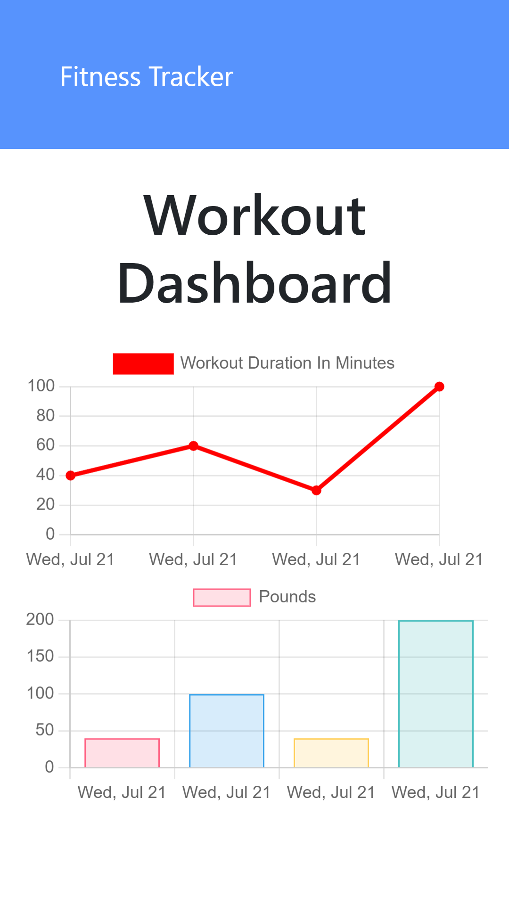

# Workout Tracker

## Description 
This application is designed to view , create and track daily workouts using Mongo database with a Mongoose schema and handling routes with Express.

## Deployment link on heroku
https://polar-springs-62390.herokuapp.com/ 

## Table of contents
- [Description](##Description)
- [Usage](##Usage)
- [Installation](##Installation)
- [Contributors](##Contributors)
- [Testing](##Testing)
- [Repository Link](#Repository)
- [GitHub Info](#GitHub) 

## User Story

* As a user, I want to be able to view create and track daily workouts. I want to be able to log multiple exercises in a workout on a given day. I should also be able to track the name, type, weight, sets, reps, and duration of exercise. If the exercise is a cardio exercise, I should be able to track my distance traveled.

## Business Context

A consumer will reach their fitness goals more quickly when they track their workout progress.

## Acceptance Criteria

When the user loads the page, they should be given the option to create a new workout or continue with their last workout.

The user should be able to:

  * Add exercises to the most recent workout plan.

  * Add new exercises to a new workout plan.

  * View the combined weight of multiple exercises from the past seven workouts on the `stats` page.

  * View the total duration of each workout from the past seven workouts on the `stats` page.

## Installation 

 * Clone repository.
 * npm install
 * node server.js
 * Running seeders/seed.js is optional to have a prepopulated database.

## Screenshots

## Github Repo
 https://github.com/poly-singh/workout_tracker 

